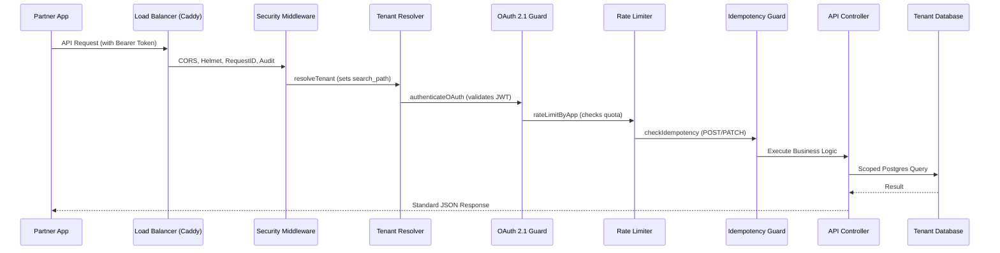

# API Platform Architecture Map

## Overview
The PageMD API Platform is a commercial-grade, multi-tenant integration layer built on top of the PageMD EMR core. It provides secure, auditable, and rate-limited access to clinical data via REST, FHIR, and AI-powered endpoints.

## 1. Request Flow Diagram

## 2. Core Modules

### 🔐 Authentication Layer
- **OAuth 2.1 Service**: [oauthService.js](file:///Volumes/Mel's SSD/paper emr/server/services/oauthService.js) - Handles token issuance (PKCE, Client Credentials).
- **Authentication Middleware**: [oauthAuth.js](file:///Volumes/Mel's SSD/paper emr/server/middleware/oauthAuth.js) - Enforces scope-based access.
- **Authorization Routes**: [oauth.js](file:///Volumes/Mel's SSD/paper emr/server/routes/oauth.js) - Standard OAuth endpoints.

### 🛡️ Secure Middleware Chain
- **Request Identification**: [apiResponse.js](file:///Volumes/Mel's SSD/paper emr/server/utils/apiResponse.js) - Injects `X-Request-Id`.
- **Tenant Isolation**: [tenant.js](file:///Volumes/Mel's SSD/paper emr/server/middleware/tenant.js) - Ensures data is strictly scoped to the tenant.
- **PHI Redaction**: [phiRedaction.js](file:///Volumes/Mel's SSD/paper emr/server/middleware/phiRedaction.js) - Prevents unauthorized PHI leakage in logs.
- **Rate Limiting**: [rateLimitByApp.js](file:///Volumes/Mel's SSD/paper emr/server/middleware/rateLimitByApp.js) - Per-app/tenant quotas.
- **Idempotency**: [idempotency.js](file:///Volumes/Mel's SSD/paper emr/server/middleware/idempotency.js) - Prevents duplicate mutations.

### 🌐 Versioned API Endpoints
- **REST v1**: [api/v1/](file:///Volumes/Mel's SSD/paper emr/server/routes/api/v1/) - Patients, Appointments, Encounters, Documents.
- **FHIR R4**: [fhirR4.js](file:///Volumes/Mel's SSD/paper emr/server/routes/fhirR4.js) - Standardized clinical data exchange.
- **AI Gateway**: [aiGateway.js](file:///Volumes/Mel's SSD/paper emr/server/routes/aiGateway.js) - Protected AI clinical assistance.

### 📨 Webhook & Eventing System
- **Outbox Worker**: [webhookWorker.js](file:///Volumes/Mel's SSD/paper emr/server/workers/webhookWorker.js) - Background delivery of clinical events.
- **Subscription Management**: [webhooks.js](file:///Volumes/Mel's SSD/paper emr/server/routes/api/v1/webhooks.js) - CRUD for webhook endpoints.

## 3. Data Flow

### Database Models
| Table | Description |
|-------|-------------|
| `partners` | Organization definitions providing API integrations. |
| `apps` | OAuth clients belonging to partners with scopes and rate limits. |
| `oauth_tokens` | Issued access and refresh tokens. |
| `outbox_events` | Pending notifications for clinical changes. |
| `webhook_deliveries` | Audit trail of webhook attempts and responses. |
| `idempotency_records` | Cached responses for idempotent requests. |

## 4. Security Principles
1.  **Least Privilege**: All API access is scope-bound (e.g., `patient.read`, `encounter.write`).
2.  **Auditability**: Every request is logged with its correlation ID and authenticated user/app.
3.  **Isolation**: Multi-tenancy is enforced at the database schema level via `search_path`.
4.  **Resilience**: Rate limiting and timeouts protect against DoS and slow client issues.
